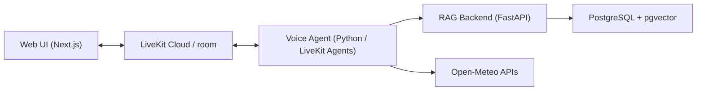

# LiveKit RAG Voice Assistant


A realtime AI voice assistant built with LiveKit, Next.js, FastAPI, and PostgreSQL + pgvector. The project supports natural voice conversation, document-grounded RAG answers, weather tool calls, typed fallback, and a compact session telemetry UI for the live pipeline.

## Features

- Realtime voice agent powered by LiveKit Agents with VAD, STT, LLM, TTS, interruptions, and typed input fallback
- RAG backend with document ingestion for `.txt`, `.pdf`, and `.docx` files
- Retrieval-only backend flow for the voice agent so the agent LLM gives the final grounded answer
- PostgreSQL + pgvector storage for embeddings and retrieval
- Weather tool integration using Open-Meteo
- Live pipeline rail and tooling/grounding status panel in the web UI
- Full Docker Compose setup for frontend, agent, backend, and database

## Architecture



Runtime flow:

1. The browser asks the Next.js app for a LiveKit token, then joins a LiveKit room and streams microphone or typed input.
2. The Python voice agent handles STT, tool routing, grounded answer generation, and TTS inside the LiveKit session.
3. For KB questions, the agent calls the RAG backend at `/retrieval/context`.
4. The backend retrieves and reranks excerpts from PostgreSQL + pgvector, then returns compact context.
5. The agent synthesizes the final spoken answer in one consistent voice/persona.

The Next.js token route is intentionally not shown as a main box in the diagram because it is part of the web app, not a separate long-running service.

## Project Structure

```text
.
├─ apps
│  ├─ agent          # LiveKit voice worker
│  └─ web            # Next.js frontend
├─ docs
│  └─ sample-documents  # Example documents for RAG testing
├─ services
│  ├─ rag-backend    # FastAPI RAG service
│  └─ RAG_Chatbot    # Legacy/reference source kept in repo
├─ docker-compose.yml
├─ LICENSE
└─ README.md
```

## Prerequisites

- Docker Desktop
- A LiveKit Cloud project
- LiveKit URL, API key, and API secret
- A backend provider key that matches `CHAT_PROVIDER` in `services/rag-backend/.env`
  - the default `.env.example` uses `CHAT_PROVIDER=groq`, so the usual requirement is `GROQ_API_KEY`

## Quick Start

### 1. Clone the project

```powershell
git clone <your-repo-url>
cd livekit-rag-voice-assistant
```

### 2. Create environment files

```powershell
Copy-Item apps\web\.env.example apps\web\.env.local
Copy-Item apps\agent\.env.example apps\agent\.env
Copy-Item services\rag-backend\.env.example services\rag-backend\.env
```

Update those files with your own credentials and provider keys.

### 3. Start the full stack

```powershell
docker compose up --build -d
```

Services:

- Web UI: [http://localhost:3000](http://localhost:3000)
- RAG backend health: [http://localhost:8000/health](http://localhost:8000/health)
- RAG backend readiness: [http://localhost:8000/ready](http://localhost:8000/ready)
- RAG backend docs: [http://localhost:8000/api/v1/docs](http://localhost:8000/api/v1/docs)
- PostgreSQL: `localhost:5432`

Notes:

- The web container builds the Next.js app on startup so it can use the values from `apps/web/.env.local`.
- The agent container downloads its model assets on first startup and stores them in a named Docker volume for faster restarts.
- LiveKit itself is not self-hosted in this repo. The stack connects to your LiveKit Cloud project.

### 4. Ingest a sample document

From the repository root:

```powershell
Invoke-RestMethod `
  -Uri http://localhost:8000/documents/ingest/file `
  -Method Post `
  -Form @{ file = Get-Item "docs\\sample-documents\\Guide To Benefits.pdf" }
```

### 5. Test the assistant

Try knowledge-base questions like:

- `What is the maximum auto rental coverage amount?`
- `What is the maximum emergency medical and dental benefit?`

You can also test the other paths:

- `What is the weather in Lahore?`
- `Explain what FastAPI is.`

Expected behavior:

- document questions use the knowledge base
- weather questions use the weather tool
- general questions are answered normally without tools

## Environment Variables

The full defaults live in:

- `apps/web/.env.example`
- `apps/agent/.env.example`
- `services/rag-backend/.env.example`

Below are the main variables most people need to understand first.

### Web: `apps/web/.env.local`

| Variable | Description | Example |
| --- | --- | --- |
| `LIVEKIT_URL` | LiveKit Cloud WebSocket URL used by the token route | `wss://your-project.livekit.cloud` |
| `LIVEKIT_API_KEY` | Server-side key used to mint room tokens | `your_livekit_api_key` |
| `LIVEKIT_API_SECRET` | Server-side secret used to mint room tokens | `your_livekit_api_secret` |
| `NEXT_PUBLIC_LIVEKIT_URL` | Client-side LiveKit URL used by the frontend | `wss://your-project.livekit.cloud` |
| `NEXT_PUBLIC_LIVEKIT_AGENT_NAME` | Agent name the frontend expects in the room | `livekit-rag-voice-agent` |

### Agent: `apps/agent/.env`

| Variable | Description | Example |
| --- | --- | --- |
| `LIVEKIT_URL` | LiveKit Cloud WebSocket URL for the worker | `wss://your-project.livekit.cloud` |
| `LIVEKIT_API_KEY` | Worker API key | `your_livekit_api_key` |
| `LIVEKIT_API_SECRET` | Worker API secret | `your_livekit_api_secret` |
| `LIVEKIT_AGENT_NAME` | Registered LiveKit agent name | `livekit-rag-voice-agent` |
| `AURALIS_STT_MODEL` | STT model identifier | `deepgram/flux-general-en` |
| `AURALIS_LLM_MODEL` | Main conversational LLM used by the voice agent | `openai/gpt-4.1-mini` |
| `AURALIS_TTS_MODEL` | TTS model identifier | `cartesia/sonic-3` |
| `AURALIS_TTS_VOICE` | TTS voice identifier | `9626c31c-bec5-4cca-baa8-f8ba9e84c8bc` |
| `RAG_BACKEND_URL` | Base URL of the RAG backend | `http://localhost:8000` |
| `RAG_CONTEXT_PATH` | Retrieval endpoint used by the agent for KB context | `/retrieval/context` |
| `RAG_CHAT_PATH` | Legacy/backend chat endpoint kept for compatibility | `/chat/ask` |

### Backend: `services/rag-backend/.env`

For most setups, you only need to understand or change the variables below. The rest of the retrieval and reranking settings in `.env.example` are advanced tuning knobs and can usually stay at their defaults.

| Variable | Description | Example |
| --- | --- | --- |
| `POSTGRES_DB` | PostgreSQL database name | `rag_chatbot` |
| `POSTGRES_USER` | PostgreSQL user | `rag_user` |
| `POSTGRES_PASSWORD` | PostgreSQL password | `rag_password` |
| `POSTGRES_HOST` | PostgreSQL host | `postgres` |
| `POSTGRES_PORT` | PostgreSQL port | `5432` |
| `EMBEDDING_PROVIDER` | Embedding provider implementation | `local` |
| `CHAT_PROVIDER` | Chat provider used by the backend configuration and legacy `/chat/ask` path | `groq` |
| `GROQ_API_KEY` | Provider key required when `CHAT_PROVIDER=groq` | `gsk_...` |
| `CORS_ALLOWED_ORIGINS` | Allowed browser origins | `http://localhost:3000` |

## Docker Commands

Start everything:

```powershell
docker compose up --build -d
```

Watch logs:

```powershell
docker compose logs -f
docker compose logs -f agent
docker compose logs -f rag-backend
```

Stop everything:

```powershell
docker compose down
```

Rebuild a single service:

```powershell
docker compose up --build web
docker compose up --build agent
docker compose up --build rag-backend
```

## Local Development Without Docker

### Frontend

```powershell
cd apps/web
npm install
npm run dev
```

### Agent

```powershell
cd apps/agent
python -m venv .venv
.\.venv\Scripts\Activate.ps1
python -m pip install --upgrade pip
pip install -r requirements.txt
python agent.py download-files
python agent.py dev
```

### Backend

```powershell
cd services/rag-backend
python -m venv .venv
.\.venv\Scripts\Activate.ps1
pip install -r requirements.txt -r requirements-test.txt
uvicorn app.main:app --host 0.0.0.0 --port 8000 --reload
```

## Useful Scripts

From the repository root:

```powershell
npm run lint:web
npm run typecheck:web
npm run build:web
npm run test:agent
npm run test:rag-backend
```

## Notes

- `services/rag-backend` is the active backend used by the voice agent.
- `services/RAG_Chatbot` is kept as a legacy/reference source and is not the main runtime path.
- The voice agent uses the retrieval-only KB flow for live grounded answers.
- `/chat/ask` still exists for backend-only testing and compatibility.

## License

This project is licensed under the MIT License. See [LICENSE](./LICENSE).
